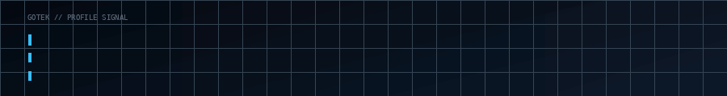
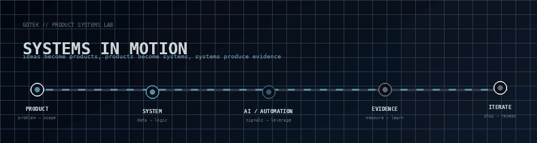
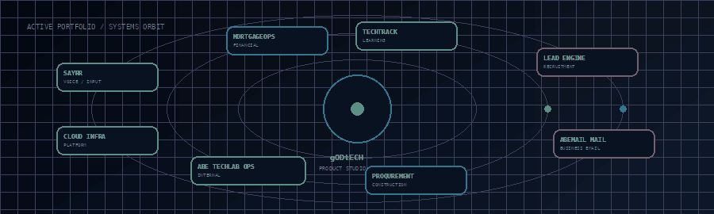
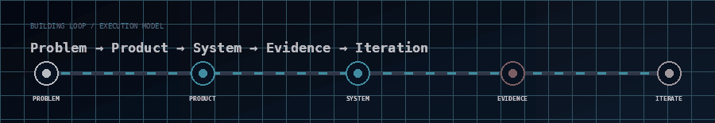
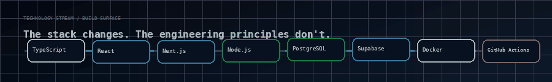
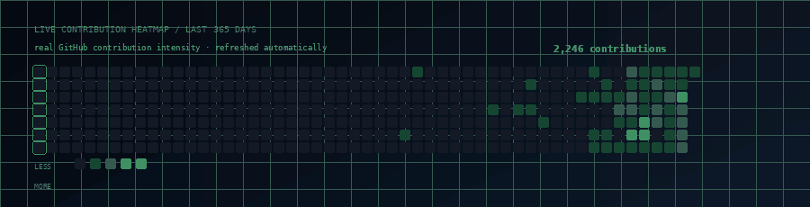
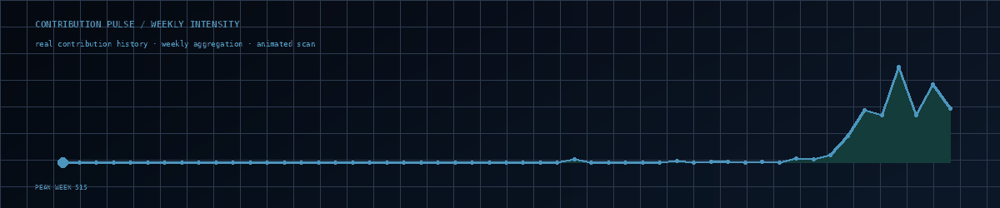
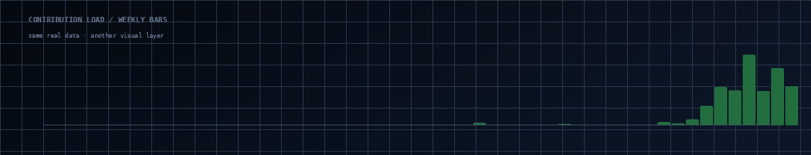
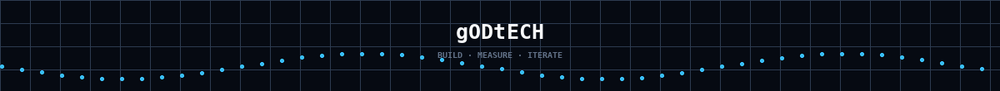

<div align="center">

# 👋🏽 Ayo Richard Abe

### **gODtECH**

<p>
  
</p>

<p>
  <a href="https://github.com/gODtECH-Ctl-Create">GitHub</a> ·
  <a href="https://www.linkedin.com/in/ayo-richard-abe/">LinkedIn</a> ·
  <a href="https://github.com/gODtECH-Ctl-Create?tab=repositories">Projects</a>
</p>

</div>

<div align="center">

</div>

---

## 🧭 About me

I work at the intersection of **product, technology, systems, and execution**.

My focus is simple: understand the problem, design the system, build the product, test what is real, and keep improving it.

<table>
<tr>
<td width="33%" align="center">

### 🧠 Product
Product strategy, requirements, roadmaps, user flows, validation, delivery.

</td>
<td width="33%" align="center">

### ⚙️ Systems
Architecture, APIs, databases, integrations, automation, operational platforms.

</td>
<td width="33%" align="center">

### 🚀 Building
From prototype to production, with a bias toward useful, measurable software.

</td>
</tr>
</table>

---

## 🔨 Currently building

<div align="center">

</div>

| Project | Focus | Stage |
| --- | --- | --- |
| 🎙️ **[SAYRR](https://github.com/gODtECH-Ctl-Create/SAYRR)** | Voice-first input layer that turns speech into clean text wherever you type | Building |
| 🏦 **[MortgageOps](https://github.com/gODtECH-Ctl-Create/MortgageOps)** | Mortgage operations, credit, financial control, and case management | Building |
| 🎓 **[TechTrack](https://github.com/gODtECH-Ctl-Create/techtrack-chi)** | Learning, bootcamp, internship, and career development platform | Building |
| 🧠 **[Lead Engine](https://github.com/gODtECH-Ctl-Create/lead-engine)** | Recruitment intelligence for discovering, verifying, and organizing hiring-market data | Building |
| 🧭 **[ABE TechLab Operations](https://github.com/gODtECH-Ctl-Create/ABE-TechLab-Operations)** | Internal operating system for CRM, research, outreach, content, analytics, and Artificial Intelligence (AI)-assisted operations | Internal |
| ☁️ **[Cloud Infrastructure Platform](https://github.com/gODtECH-Ctl-Create/Cloud-Infrastructure-Platform)** | Infrastructure laboratory for building a cloud platform from first principles | Building |
| ♻️ **Waste2Work** | Workspace, operations, and time-billing platform direction | Building |
| ✉️ **[ABEmail Mail](https://github.com/gODtECH-Ctl-Create/ABEmail-Mail)** | Business email workspace and managed-domain mail infrastructure | Building |

---

## 🚀 Products & selected work

| Product / project | What it is |
| --- | --- |
| 🏗️ **[Proqurement](https://github.com/gODtECH-Ctl-Create/proqurement)** | Discovery-first construction procurement and market intelligence platform |
| 🏥 **OHealth+** | Healthcare technology platform and digital healthcare workflows |
| 🏫 **Cyfamod SMS** | School management system for students, classes, attendance, results, fees, staff, and communication |
| 🧠 **Vertica** | Recruitment and product workflow platform |
| 🧪 **ABE TechLab** | Product studio and technology lab for software, systems, and experiments |
| ♻️ **Waste2Light** | Renewable-energy, circular-economy, and practical innovation platform |
| 🍽️ **Lucid** | Legacy restaurant Point of Sale (POS) and operations product experiment |

---

## 🔁 The build loop

<div align="center">

</div>

> **Problem → Product → System → Evidence → Iteration**

I care about the difference between something that **looks finished** and something that **actually works**.

That means real persisted data, measurable system state, documented architecture, security, reliability, and small validated steps that can grow into production systems.

---

## 🛠️ Technology landscape

<div align="center">

</div>

| Area | Tools & technologies |
| --- | --- |
| Frontend | React, Next.js, TanStack, TypeScript, Tailwind CSS |
| Backend | Node.js, Python, FastAPI, NestJS |
| Data | PostgreSQL, Supabase, MongoDB, SQLite |
| Infrastructure | Vercel, Docker, GitHub Actions, libvirt, virtual machines |
| Product & design | Figma, product specifications, system architecture, UX flows |
| Artificial Intelligence | AI-assisted workflows, research agents, content systems, intelligent operations |

---

# 🔥 Contribution Heatmap Lab

<div align="center">

### Real contribution data. Multiple visual layers. No fabricated activity.

The local heatmap animation is generated from this GitHub account's public contribution history and refreshed automatically by GitHub Actions.

</div>

### 01 · Contribution heatmap scan

<div align="center">

</div>

### 02 · Contribution rhythm

<div align="center">

</div>

### 03 · Contribution load

<div align="center">

</div>

### 04 · GitHub profile signal

The contribution visuals above are repository-hosted media, so the profile does not depend on a third-party chart renderer to display its core activity section.

---

## 🗺️ Current direction

```text
NOW
├── Product architecture and delivery
├── Voice-first interfaces with SAYRR
├── Financial workflow systems with MortgageOps
├── Learning and career infrastructure with TechTrack
├── Recruitment intelligence with Lead Engine
├── AI-assisted internal operations with ABE TechLab Operations
├── Cloud infrastructure foundations
├── Waste2Work platform development
└── Business email infrastructure with ABEmail Mail

NEXT
├── Production hardening
├── Better observability and testing
├── Stronger security boundaries
├── Reusable product architecture patterns
└── Turning validated experiments into independent products
```

---

## 📚 Selected documentation & product work

A lot of the work behind these repositories lives in product specifications, architecture documents, technical decisions, roadmaps, testing plans, and implementation notes.

<details>
<summary><strong>Explore the way the projects are organized</strong></summary>

```text
Product
├── Problem definition
├── Product requirements
├── User flows
├── MVP scope
└── Roadmap

Technology
├── Architecture
├── Data model
├── API contracts
├── Security
└── Deployment

Execution
├── GitHub Issues
├── Branches / PRs
├── CI validation
├── Testing
└── Release checks
```

</details>

---

## 🤝 Connect

I'm interested in conversations around **products, technology, systems, Artificial Intelligence (AI), infrastructure, and practical innovation**.

<div align="center">

[GitHub](https://github.com/gODtECH-Ctl-Create) · [LinkedIn](https://www.linkedin.com/in/ayo-richard-abe/)

</div>

---

<div align="center">

### Built with curiosity. Shipped with intent.

_Keep building things that are useful._

<p>

</p>

</div>
